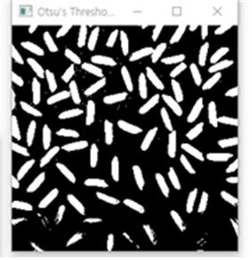

# 2. Otsu’s Thresholding and Labeling & dilation and erosion
> ## Otsu’s Thresholding and Labeling
> ### Thresholding
- Optimal Thresholding
    - A criterion functions should be devised that yields some measure of separation between regions.
    - The intensity value maximizing(or minimizing) the criterion function is considered as the optimal threshold.
    
> ### Otsu's Thresholding
    
   
> ### result



> ### Code
```C++
 KImageGray igImg;

    //포커스 된 ImageForm으로부터 영상을 가져옴
    if(_q_pFormFocused != 0 && _q_pFormFocused->ImageGray().Address() &&  _q_pFormFocused->ID() == "OPEN")
    {
        igImg = _q_pFormFocused->ImageGray();

    }
    else
        return;

    //To get its histogramming
    int histo[256] = {0, };
    double sigmab[256] = {0,};
    double N = igImg.Size() ,p,q1,q2,u,u1=0,u2=0,temp_q1,T;
    double max = -1;


    //histogram
    for(unsigned int i=0; i<igImg.Row(); i++){
        for(unsigned int j=0; j<igImg.Col(); j++)
        {
            histo[igImg[i][j]] += 1;
        }
    }


    for(int t = 0; t<255;t++){
       p = (double)histo[t] / (double) N;
       u += ((double)t)*p;
    }

    //Find T
    p = (double)histo[0]/(double)N;

    q1 = p;
    q2 = 1.0 - q1;
    sigmab[0]=q1*q2*(u1-u2)*(u1-u2);


    for(int t=1;t<256;t++)
    {
        p = (double)histo[t]/(double)N;
        temp_q1 = q1;
        q1 += p;
        q2 = 1.0 - q1;
        if(q1 ==0)
        {
            u1=0;
            u2 = (u - q1 * u1) / (1.0 - q1);
        }
        else if(q2 == 0)
        {
            u2=0;
            u1 = ((temp_q1 * u1) + ((double)(t)*p)) / (q1);
        }
        else
        {
            u1 = ((temp_q1 * u1) + ((double)(t)*p)) / (q1);
            u2 = (u - q1 * u1) / (1.0 - q1);
        }

        sigmab[t] = q1*q2*(u1-u2)*(u1-u2);
    }

    for(int i = 0; i < 256; i++)
    {
        if(max < sigmab[i])
        {
            max = sigmab[i];
            T = i;
        }
    }


    //Thresholding
    for(int i=0; i<igImg.Row(); i++)
    {
        for(int j=0; j<igImg.Col(); j++)
        {
            if(igImg[i][j] > T) igImg[i][j] = 255; //foreground
            else igImg[i][j] = 0; //background
        }
    }
```

> ### Labeling
- Neighbors
    - 4-Neighbors(상하좌우)
    - 8-Neighbors(상하좌우+대각선) <- Code


- Algorithm (Binary Image)
    1. 전경인 픽셀일 경우
    2. 이전에 '확인했던' 주변을 확인
    3. 주변이 모두 배경이라면 새로운 label 부여
    4. 주변에 label이 있다면 같은 label 부여
    5. 주변의 label이 여러개인 경우 우선순위에 따라 label 부여
    6. Second Pass를 통해 좀 더 정확한 Labeling

> ### result


> ### Code
```C++
//Image Labeling

    KImageGray igImg2 = igImg;
    int label[igImg2.Row()][igImg2.Col()];
    std::fill(&label[0][0], &label[igImg2.Row()-1][igImg2.Col()-1], 0);

    int label_num = 1;

    for(int i = 1; i<igImg2.Row()-1;i++)
    {
        for(int j = 1; j<igImg2.Col()-1;j++)
        {
            if(igImg2[i][j] == 255) //foreground
            {
                if( (igImg2[i-1][j-1] == 0 && igImg2[i-1][j] == 0 && igImg2[i][j-1] == 0) || (label[i-1][j-1] == 0 && label[i-1][j] == 0 && label[i][j-1] == 0)) // 대각선 위 오른쪽이 전부 배경
                {
                    label[i][j] = label_num; // label 추가
                    label_num++;
                }
                else if(igImg2[i-1][j-1] == 0 && igImg2[i-1][j] == 255 && igImg2[i][j-1] == 0) //위쪽만 전경
                {
                    label[i][j] = label[i-1][j];
                }
                else if(igImg2[i-1][j-1] == 0 && igImg2[i-1][j] == 0 && igImg2[i][j-1] == 255) //왼쪽만 전경
                {
                    label[i][j] = label[i][j-1];
                }
                else if(igImg2[i-1][j-1] == 255 && igImg2[i-1][j] == 0 && igImg2[i][j-1] == 0) //대각선만 전경
                {
                    label[i][j] = label[i-1][j-1];
                }
                else if(igImg2[i-1][j-1] == 255 && igImg2[i-1][j] == 0 && igImg2[i][j-1] == 255) //대각선이랑 왼쪽만 전경
                {
                    label[i][j] = label[i][j-1];
                    label[i-1][j] = label[i][j-1];
                }
                else if(igImg2[i-1][j-1] == 255 && igImg2[i-1][j] == 255 && igImg2[i][j-1] == 0) //대각선이랑 위쪽만 전경
                {
                    label[i][j] = label[i-1][j];
                    label[i][j-1] = label[i-1][j];
                }
                else if(igImg2[i-1][j-1] == 0 && igImg2[i-1][j] == 255 && igImg2[i][j-1] == 255) //왼쪽이랑 위쪽만 전경
                {
                    label[i][j] = label[i-1][j];
                    label[i][j-1] = label[i-1][j];
                }
                else if(igImg2[i-1][j-1] == 255 && igImg2[i-1][j] == 255 && igImg2[i][j-1] == 255) // 전부 전경
                {
                    label[i][j] = label[i-1][j]; //위쪽 , 왼쪽, 대각선 순 우선순위
                    label[i-1][j-1] = label[i-1][j];
                    label[i][j-1] = label[i-1][j];
                }
            }
        }
    }


    // Second Pass
    for(int i = 1; i<igImg2.Row()-1;i++)
    {
        for(int j = igImg2.Col()-2; j > 1;j--)
        {
            if(igImg2[i][j] == 255) //foreground
            {
                if(igImg2[i-1][j-1] == 0 && igImg2[i-1][j] == 0 && igImg2[i][j-1] == 255) //왼쪽만 전경
                {
                    label[i][j-1] = label[i][j];
                }
                else if(igImg2[i-1][j-1] == 0 && igImg2[i-1][j] == 255 && igImg2[i][j-1] == 0) //위쪽만 전경
                {
                    label[i][j] = label[i-1][j];
                }
                else if(igImg2[i-1][j-1] == 255 && igImg2[i-1][j] == 255 && igImg2[i][j-1] == 255) // 전부 전경
                {
                    label[i][j] = label[i-1][j]; //위쪽 , 왼쪽, 대각선 순 기준
                    label[i-1][j-1] = label[i-1][j];
                    label[i][j-1] = label[i-1][j];
                }

            }
        }
    }


    KImageColor imglabel = KImageColor(igImg2.Row(),igImg2.Col());

    for(unsigned int ii = 1;ii<igImg2.Row();ii++)
              for(unsigned int jj = 1;jj<igImg2.Col();jj++)
          {
              imglabel[ii][jj].b = label[ii][jj];
              imglabel[ii][jj].r = (5* label[ii][jj]) % 256 ;
              imglabel[ii][jj].g = (10* label[ii][jj]) % 256;
          }
```    


> ## dilation and erosion
> ### dilation

    
> ### erosion
      

> ### Code
```C++

```
